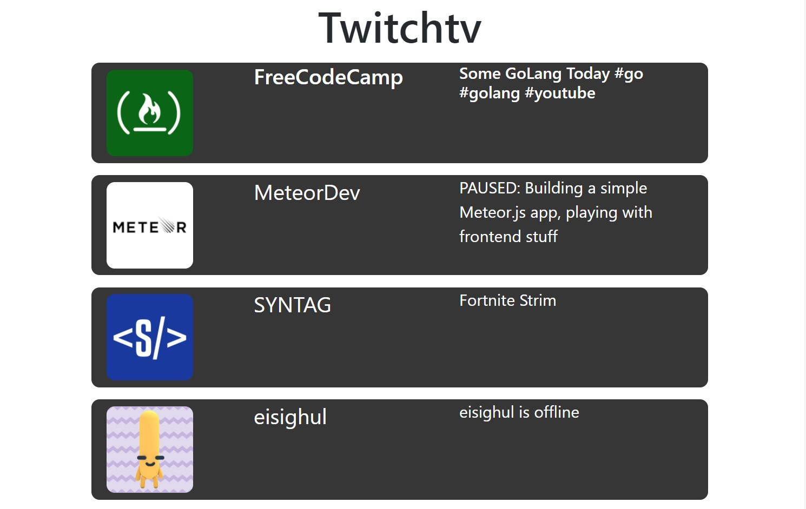

# twitchtv_app
Twitch Tv App for FreeCodeCamp.org.

I used the FreeCodeCamp workaround API, Bootstrap CSS CDN plus some JQuery to create the project.  This project is a work in progress.  Check back for updates.

This is what the project looks like so far.

